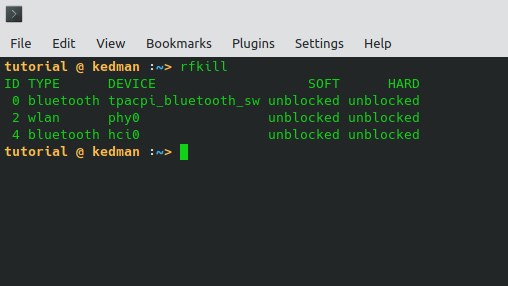
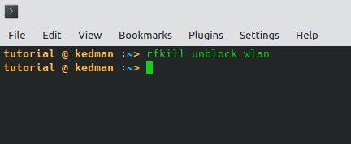
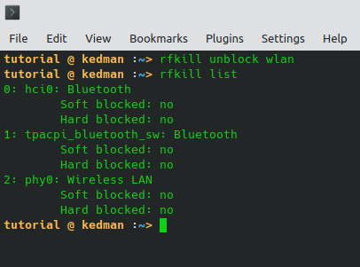
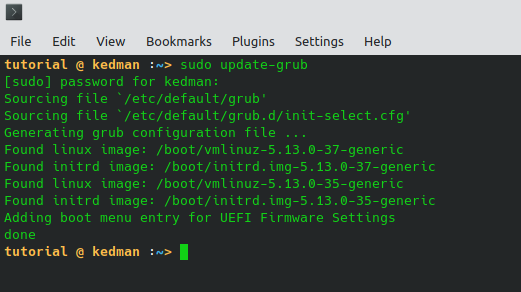

I recently helped a friend migrate to Zorin OS. I'm not using it myself but I'd seen so many reviews I was tempted to try it out so when I made a flash disk with several Linux distros and Zorin was one of them.

The GUI looks good but it seems that by default, some  Even though it's supposed to be friendly for those migrating to Ubuntu, many of the drivers give issues that can take endless internet trolling to find solutions.

The laptop had issues with the touchscreen in Firefox, issues with setting up the printer drivers and issues with the WiFi.

For some dreary reason, every time the screen went into inactive state and locked, so did the WiFi. It went into airplane mode immediately and nothing short of a restart brought it back on.

It took hours to find a solution. I tried all the popular solutions that were put on StackOverflow, on Zorin's help desk and community page, AskUbuntu and some more that I no longer recall. I'm putting the most popular suggestions here because it might work of the bat for some people, then the one that worked for me, if the problem persists.

### The usual StackOverflow solutions

`rfkill`

Run it and you will find all the radio devices that are on the computer.



EXAMPLE commands taken from the man page for rfkill.

```bash
       rfkill --output ID,TYPE
       rfkill block all
       rfkill unblock wlan
       rfkill block bluetooth uwb wimax wwan gps fm nfc
```

I ran all the variations of this command and none of them worked.





So I continued to look. Then I stumbled on the next solution which involves the ACPI kernel parameter. I'll present the solution first before trying to explain what the `acpi` stands for or does.

### Another almost hidden solution

I found this solution on StackOverflow, tucked away in one of the answers. It took a long time to find it, and that's one of the reasons I decided to write about it.

First you'll open your grub file.

```
sudo nano /etc/default/grub
```


Then on the line with: GRUB_CMDLINE_LINUX_DEFAULT="quiet splash",  *add*  `acpi_osi=!` and you are done.

```
GRUB_CMDLINE_LINUX_DEFAULT="quiet splash acpi_osi=!"
```


One can also enter `acpi_osi="Linux"` which works well on Linux, or
`acpi_osi='Windows 2019'` to mimic Windows 10, version 1903.

`acpi_osi=!` disables the built-in vendor strings such as 'Windows 2019' or 'Linux' as written above. It can be used in conjunction with another OS string like so:

`acpi_osi=! acpi_osi='Windows 2019'`

After entering this value, hit CTRL-S, CTRL-X to save and exit.

Then you have to update the grub or the problem will stay and not go away despite your best efforts.

`sudo update-grub`



### My Tuppence

#### What's the use of ACPI kernel parameter?

ACPI is short for Advanced Configuration and Power Interface. It is a tool that helps your Linux computer communicate with the BIOS using the right operating system identifiers (OSI) to deal with some of the issues that may arise when you switch a computer that shipped with Windows to Linux. Sometimes it also helps to deal with driver incompatibility in Windows even if you did not switch operating systems. That's a very short explanation.

The ACPI kernel parameter helps with things like the touchpad, touchscreen and and others that came with the OS vendor.
For more details, [Kernel](https://www.kernel.org/doc/Documentation/admin-guide/kernel-parameters.txt) will help.